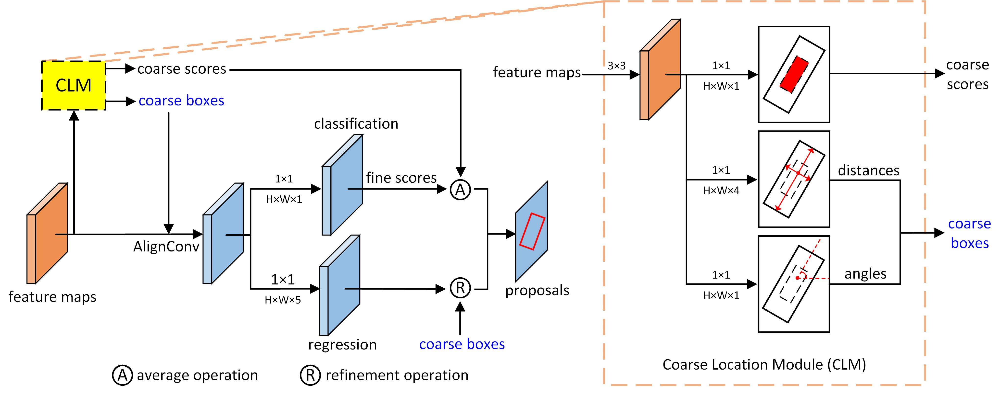

# [Anchor-free Oriented Proposal Generator for Object Detection](https://arxiv.org/abs/2110.01931)

Gong Cheng, Jiabao Wang, Ke Li, Xingxing Xie, Chunbo Lang, Yanqing Yao, Junwei Han,


## Introudction



Oriented object detection is a practical and challenging task in remote sensing image interpretation. Nowadays, oriented detectors mostly use horizontal boxes as intermedium to derive oriented boxes from them. However, the horizontal boxes are inclined to get a small Intersection-over-Unions (IoUs) with ground truths, which may have some undesirable effects, such as introducing redundant noise, mismatching with ground truths, detracting from the robustness of detectors, etc. In this paper, we propose a novel Anchor-free Oriented Proposal Generator (AOPG) that abandons the horizontal boxes-related operations from the network architecture. AOPG first produces coarse oriented boxes by Coarse Location Module (CLM) in an anchor-free manner and then refines them into high-quality oriented proposals. After AOPG, we apply a Fast R-CNN head to produce the final detection results. Furthermore, the shortage of large-scale datasets is also a hindrance to the development of oriented object detection. To alleviate the data insufficiency, we release a new dataset on the basis of our DIOR dataset and name it DIOR-R. Massive experiments demonstrate the effectiveness of AOPG. Particularly, without bells and whistles, we achieve the highest accuracy of 64.41%, 75.24% and 96.22% mAP on the DIOR-R, DOTA and HRSC2016 datasets respectively.

## Benchmark and model zoo

| Model | Backbone |  Dataset | ms | rr | Lr schd |  mAP  | Google | Baidu Yun |
|:-----:|:--------:|:--------:|:--:|:--:|:-------:|:-----:|:------:|:---------:|
|  AOPG |  R50-FPN |  DIOR-R  |  - |  - |    1x   | 64.41 |    -   |     -     |
|  AOPG |  R50-FPN |  DOTA1.0 |  - |  - |    1x   | 75.24 |    -   |     -     |
|  AOPG | R101-FPN |  DOTA1.0 |  - |  - |    1x   | 75.39 |    -   |     -     |
|  AOPG |  R50-FPN |  DOTA1.0 |  √ |  √ |    1x   | 80.66 |    -   |     -     |
|  AOPG | R101-FPN |  DOTA1.0 |  √ |  √ |    1x   | 80.19 |    -   |     -     |
|  AOPG |  R50-FPN | HRSC2016 |  - |  - |    3x   | 96.22 |    -   |     -     |

You can download DIOR-R dataset at [https://gcheng-nwpu.github.io/](https://gcheng-nwpu.github.io/).

## Installation

Please refer to [install.md](docs/install.md) for installation and dataset preparation.

## Get Started

Please refer to [oriented_model_starting.md](docs/oriented_model_starting.md) for training and testing.

## Citation
This repo is based on [OBBDetection](https://github.com/jbwang1997/OBBDetection).

If you use this repo in your research, please cite the following information.
```
@misc{cheng2021,
  title={Anchor-free Oriented Proposal Generator for Object Detection}, 
  author={Gong Cheng and Jiabao Wang and Ke Li and Xingxing Xie and Chunbo Lang and Yanqing Yao and Junwei Han},
  year={2021},
  eprint={2110.01931},
  archivePrefix={arXiv},
  primaryClass={cs.CV}
}

@article{RN37,
   author = {Li, Ke and Wan, Gang and Cheng, Gong and Meng, Liqiu and Han, Junwei},
   title = {Object detection in optical remote sensing images: A survey and a new benchmark},
   journal = {ISPRS Journal of Photogrammetry and Remote Sensing},
   volume = {159},
   pages = {296-307},
   ISSN = {0924-2716},
   DOI = {10.1016/j.isprsjprs.2019.11.023},
   year = {2020},
   type = {Journal Article}
}
```